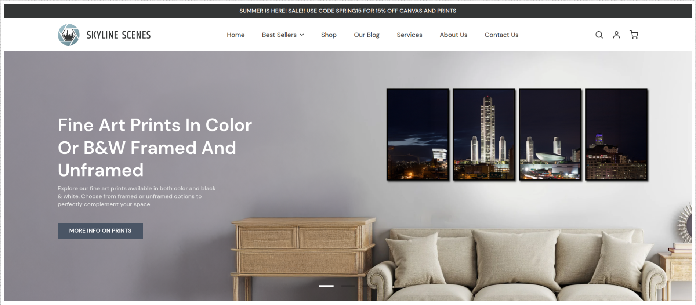
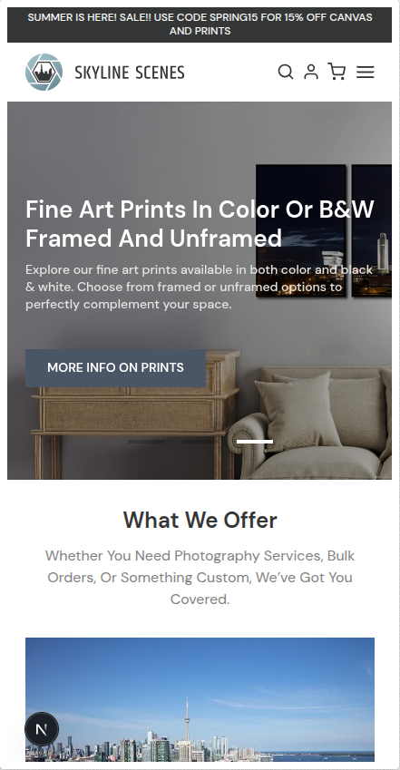
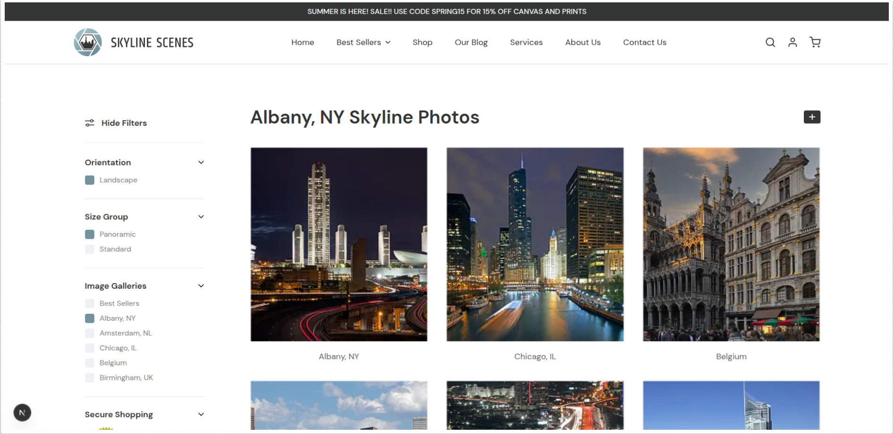
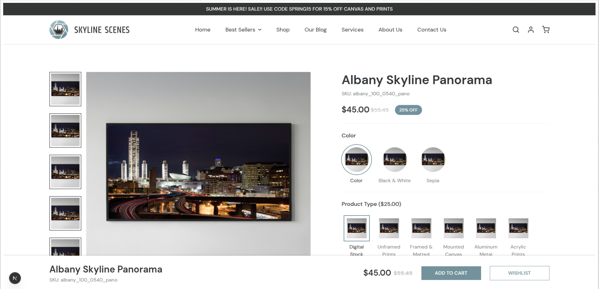

# LumaFrames

**Tagline:** “Where Every Photo Finds Its Perfect Frame.”

A clean and modern photo-frame eCommerce interface built with Next.js and Tailwind CSS. The project includes pages for:

Home / Index – Hero section, featured frames, categories
Collections Page – Grid-based layout showcasing available frame styles
Product Details Page – Large preview, zoom, pricing, sizes, add-to-cart section

This project focuses on minimal UI, smooth transitions, and responsive layouts for a premium user experience.

---

## 🚀 Live Demo

[https://luma-frames.vercel.app/](https://luma-frames.vercel.app/)

---

## 📸 Screenshots

### 🏠 Home Page

### 🖼️ Home Page Responsive

### 🖼️ Collection Page

### 📄 Product Details Page

---

## 🛠 Tech Stack

